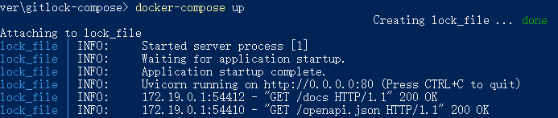
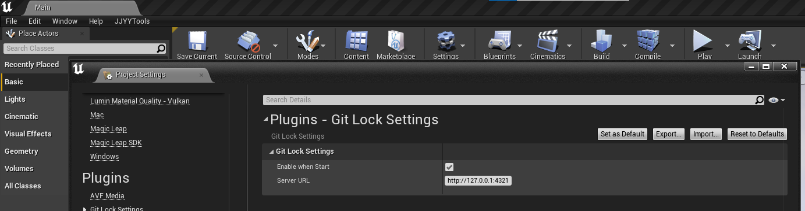
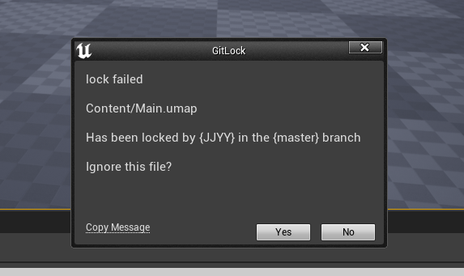
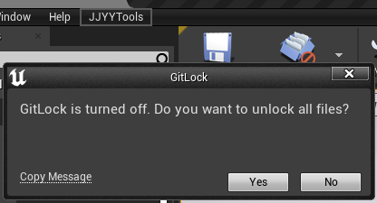
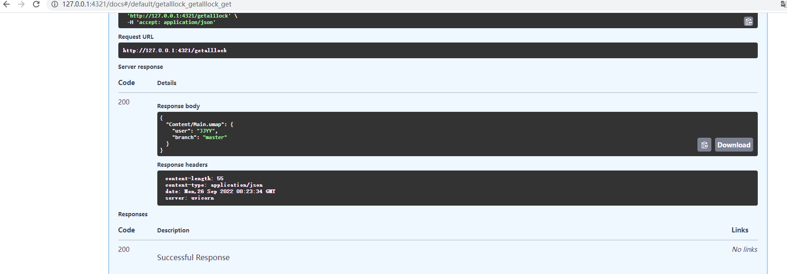

# JJYYGitLock

[](https://github.com/RichardLitt/standard-readme)

这是一个减少在使用Git作为UE版本管理的时候出现冲突的工具。本插件并不真正锁定文件，而是作为一个辅助提示。
它的实现是使用了一个服务器记录了已经修改的文件，其他人再次修改的时候会获得对应的提示（所有的记录与提示都是在保存文件的时候触发的）。
目前已经实现的功能有：
- 支持不同分支的锁定提示
- 支持手动解锁
- 支持WebHook解锁


## 内容列表

- [安装](#安装)
- [使用说明](#使用说明)
- [维护者](#维护者)
- [使用许可](#使用许可)

## 安装

直接下载Zip文件，或者使用git命令：

```
git clone https://github.com/JJYYs/JJYYGitLock.git
```

## 使用说明
本插件基于 4.27 开发，在Win64下完成测试。
### 服务器
- Docker版
拷贝 \Plugins\GitLock\Server\LockFileServer\ 下的 gitlock-compose 文件夹到另外的目录
如果需要修改配置可以修改 docker-compose.yml 文件
在新的 gitlock-compose 目录下运行：
```
docker-compose up
```
服务器启动成功后大概是这样的：


- Python版
需要 python 3.8+
Plugins\GitLock\Server\LockFileServer\requirements.txt 是依赖库
安装依赖库
```
pip install -r requirements.txt
```
Plugins\GitLock\Server\LockFileServer\app\main.py 是主程序
执行程序
```
python main.py
```

### 客户端
下载完成后 编译启动
- 在配置中填写服务器地址


- 重启后就可以正常使用了，当对文件进行修改后保存，就会尝试申请锁定当前修改的文件


- 如果文件锁定成功不会有提示，如果文件锁定失败会有提示


- 如果需要手动解锁所有文件，可以点击工具栏的开关按钮来切换启用/关闭，顺便解锁所有文件。


- 更多手动API调用可以直接在网页端打开 {url}:{port}/docs#/ 查看。


### Gitlab
gitlab 中添加一个 push event 到 {url}:{port}/gitlabpush 服务器会根据push event 自动解锁所有锁定文件。

## 维护者

[@JJYYs](https://github.com/JJYYs)

## 使用许可

[MIT](https://github.com/RichardLitt/standard-readme/blob/master/LICENSE) © JJYY
